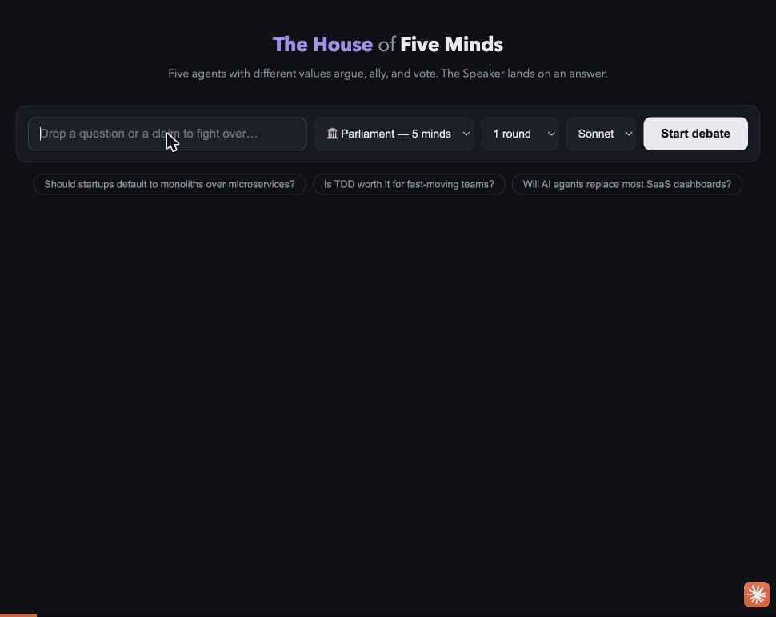

# Agentic Quorum

Watch Claude agents debate a topic live and land on an answer. Two formats:

- **⚔ Duel** — Advocate vs Skeptic argue opening / rebuttals / closing; an impartial Judge scores the debate and synthesizes a usable final answer.
- **🏛 Parliament** — five members with distinct value systems (Pragmatist, Idealist, Economist, Contrarian, Ethicist) debate a motion, ally, switch sides when out-argued, and cast a binding vote; the Speaker synthesizes the outcome.

## Demo

Parliament mode debating whether AI should be patentable:



## Installation

### Prerequisites

- **Node.js 20+** — check with `node --version`. Install from [nodejs.org](https://nodejs.org) if missing.
- **Claude Code, logged in** — this is how the app authenticates (see below). Install and log in once:
  ```sh
  npm install -g @anthropic-ai/claude-code
  claude        # opens a browser to log in with your Claude account, then quit
  ```

### Setup

```sh
git clone <repo-url>     # or copy the folder
cd agentic-quorum
npm install
npm start
```

Open **http://localhost:3457**, type a question, pick a format (Duel or Parliament), hit **Start debate**.

To change the port: `PORT=8080 npm start`.

## How it uses your Claude subscription

The app never asks for an `ANTHROPIC_API_KEY`. Every agent turn goes through the
[Claude Agent SDK](https://code.claude.com/docs/en/agent-sdk/typescript)
(`@anthropic-ai/claude-agent-sdk`), which ships its own copy of the Claude Code
binary and **reuses the login credentials Claude Code stored when you ran
`claude`**. So inference is billed to your Claude subscription (Pro/Max/Team),
exactly like a normal Claude Code session — no separate API billing, no key to
manage.

Practically: if `claude` works in your terminal, this app works. If you've never
logged in, debates fail with an auth error until you run `claude` once.

## Notes

- Agents run with all tools disabled (`tools: []`) — pure text generators.
- Parliament vote tally is computed server-side from parsed `STANCE:` declarations, not trusted to the Speaker's JSON.
- Models: Sonnet (default), Opus, Haiku. Parliament costs ~16 agent turns per debate; prefer Sonnet/Haiku.
